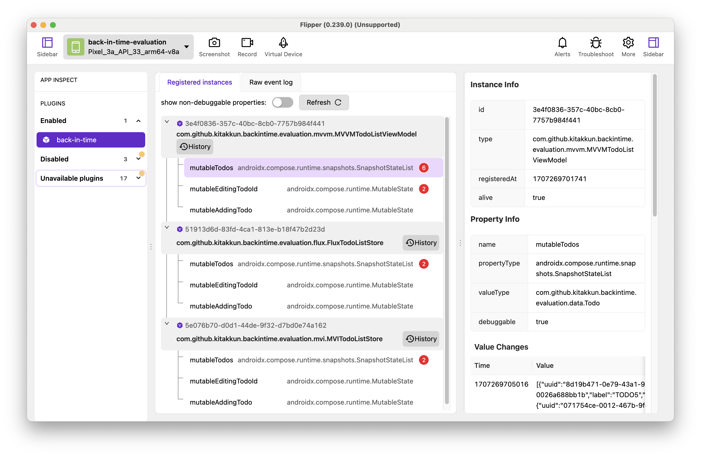

# flipper-plugin-back-in-time

[back-in-time-plugin](https://github.com/kitakkun/back-in-time-plugin) を用いてコンパイルしたプログラムと連携し，
実際に flipper を介して back-in-time デバッグを行うためのプラグインです．



## インストール

このプロジェクトは現在開発中であり，正式リリースはありません．
リポジトリをクローンして，ルートディレクトリで以下のコマンドを実行してください．

```sh
yarn pack
```

flipper-plugin-back-in-time-vx.x.x.tgz が生成されるので，Flipperから読み込み追加してください．
(More -> Add Plugins -> Install Plugins -> Select a flipper package)
